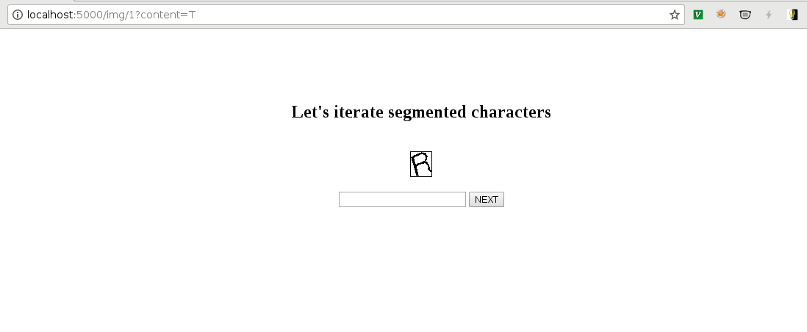

=====
About
=====

Labeller is `Flask <http://flask.pocoo.org/>`_ based Web application that
helps to label image samples as characters.
Then those character images might be used to train the classifier.

Labeller is supposed to be used after images are `segmented <segmenter.rst>`_.

Command Line Interface
======================

Currently all the parameters are hardcoded and you don't need to tweak anything.
Simply run the web app and open http://localhost:5000 in the browser::

    python3 -m ocrpack.labeller
    * Running on http://127.0.0.1:5000/ (Press CTRL+C to quit)

How does it work?
=================

Labeller iterates images in `chars/` directory:

1. `chars/0.png`
2. `chars/1.png`
3. etc.

and displays them in a Web browser:

You enter the label for an image and when you press `Next` labeller copies
character images from source directory, reorders them and the resulting tree
looks like this::

    labelled-chars
    ├── 0
    │   ├── 0.png
    │   ├── 1.png
    │   └── 2.png
    ├── 1
    │   ├── 0.png
    │   └── 1.png
    ├── 2
    │   ├── 0.png
    │   └── 1.png
    ├── 3
    │   ├── 0.png
    │   ├── 1.png
    │   └── 2.png
    ├── 4
    │   ├── 0.png
    │   └── 1.png
    └── 5
        ├── 0.png
        └── 1.png
