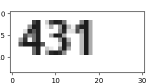
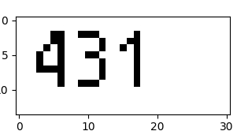
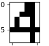
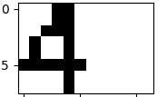
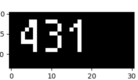

=====
About
=====

Image segmentation is a process of dividing image into separate groups:

If you have text where characters are clearly separated, segmentation greatly
easens OCR task.

This tool does exactly that - segments an image.
To make image segmentation easier, there are some image preprocessing
capabilities:

* transform image to binary
* invert colors
* resize segments
* display intermediate results

.. note::

    Specified images are always loaded in grayscale mode. Thus, the saved
    segments will always be grayscale too.

Command Line Interface
======================

::

    python3 -m ocrpack.segmenter --help
    Usage: main.py [OPTIONS]

    Options:
      -f, --file TEXT                 Absolute or relative path to image.
                                      [required]
      --invert BOOLEAN                Invert colors before doing segmentation.
                                      This option also makes the stored segments to
                                      be inverted.  [default: True]
      --resize-to TEXT                Resize segments before saving to file. E.g.
                                      "8, 6" where 8 is width and 6 is height.
      --show                          Show image after transformations before
                                      segmentation.Useful for debugging.
      --show-only                     Only show image after transformations before
                                      segmentation and do not proceed with
                                      segmentation.
      --binary-threshold, --bin-thr FLOAT
                                      If this value is set, resulting image will
                                      have only two colors: background and
                                      foreground. Pixels with greater value than
                                      this will obtain background color and
                                      with smaller value - foreground color.
      -o, --out-dir TEXT              Store image segments in this directory.
                                      Every segment is stored as a separate PNG
                                      image whose name is sequence number in the
                                      directory. E.g. 1.png, 2.png, 3.png, etc. If
                                      this option is not specified, segments are
                                      simply displayed.
      --help                          Show this message and exit.

Binary images
-------------

I've found that image segmentation algorithms work better with
`binary images <https://en.wikipedia.org/wiki/Binary_image>`_.

Original image:

Binary image::

    $ python3 -m ocrpack.segmenter -f num.png --show-only --invert false --bin-thr 0.39

`--bin-thr` parameters stands for binary threshold which means that pixels
with color higher than the threshold will be translated to background color
and lower - to foreground.

Resize segments
---------------

All images passed to machine learning classifier must be the same size.
Otherwise classification algorithm will fail.
Therefore, segmenter has an option to resize segments.

For example this image is original size (height is 8 pixels, width - 6)::

    $ python3 -m ocrpack.segmenter -f num.png --invert false --bin-thr 0.39

And this one is resized::

    $ python3 -m ocrpack.segmenter -f num.png --invert false --bin-thr 0.39 --resize-to 8,12

Color inversion
---------------

Usually we have white background and black symbols. Mathematically speaking
in grayscale mode background color is `1.0` and foreground - `0.0`:

But from machine learning algorithms perspective 0 is nothing and 1 is something.
Thus, I invert such images and pixels with value `1.0` indicate presence of
an object::

    $ python3 -m ocrpack.segmenter -f num.png --show-only --invert true

